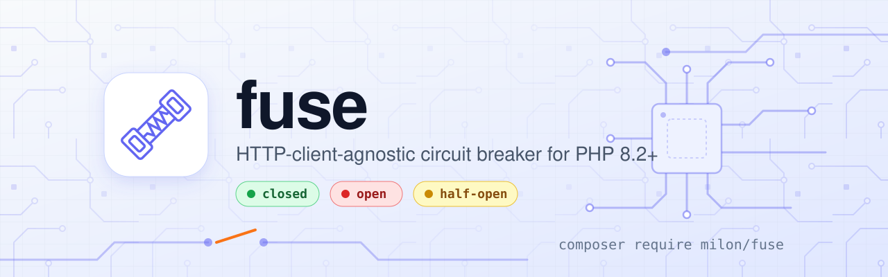

<p align="center">
  
</p>

# milon/fuse

HTTP-client-agnostic **circuit breaker** for PHP 8.2+, with an optional [Saloon](https://docs.saloon.dev/) adapter.

## Install

```bash
composer require milon/fuse
```

Laravel and Saloon are **optional** and independent. The breaker itself only needs PHP, so it runs with neither, with either, or with both. Install Saloon only if you use the connector trait:

```bash
composer require saloonphp/saloon
```

## Callable usage (no Saloon)

```php
use Milon\Fuse\Fuse;
use Milon\Fuse\CircuitBreakerConfig;
use Milon\Fuse\Stores\ArrayStore;

$fuse = Fuse::for(
    name: 'billing-sdk',
    store: new ArrayStore(),
    config: CircuitBreakerConfig::defaults(),
);

$result = $fuse->run(
    execute: fn () => $client->charge($payload),
);
```

When the circuit is open, `run()` throws `Milon\Fuse\CircuitOpenException` and does **not** invoke `execute`.

## Saloon usage

```php
use Milon\Fuse\Saloon\Traits\HasCircuitBreaker;
use Milon\Fuse\CircuitBreakerConfig;
use Milon\Fuse\Contracts\CircuitBreakerStore;
use Milon\Fuse\Stores\ArrayStore; // or LaravelCacheStore
use Saloon\Http\Connector;

class ExampleConnector extends Connector
{
    use HasCircuitBreaker;

    public function resolveBaseUrl(): string
    {
        return 'https://api.example.com';
    }

    protected function resolveCircuitBreakerName(): string
    {
        return 'example';
    }

    protected function resolveCircuitBreakerConfig(): CircuitBreakerConfig
    {
        return CircuitBreakerConfig::defaults();
    }

    protected function resolveCircuitBreakerStore(): CircuitBreakerStore
    {
        return new ArrayStore();
    }
}
```

## Laravel

In a Laravel application the service provider is discovered automatically. It shares circuit state through the cache and reads `config/fuse.php`. Publish that file to change the defaults:

```bash
php artisan vendor:publish --tag=fuse-config
```

```php
use Milon\Fuse\Laravel\FuseManager;

$fuse = app(FuseManager::class)->for('billing-sdk');

$result = $fuse->run(
    execute: fn () => $client->charge($payload),
);
```

Set `cache_store` to pin Fuse to a cache store. Add a `breakers` entry to override the defaults for one circuit name.

A Saloon connector can take the same store and config from the container:

```php
use Milon\Fuse\CircuitBreakerConfig;
use Milon\Fuse\Contracts\CircuitBreakerStore;
use Milon\Fuse\Laravel\FuseManager;

protected function resolveCircuitBreakerStore(): CircuitBreakerStore
{
    return app(CircuitBreakerStore::class);
}

protected function resolveCircuitBreakerConfig(): CircuitBreakerConfig
{
    return app(FuseManager::class)->configFor($this->resolveCircuitBreakerName());
}
```

If package discovery is disabled, register `Milon\Fuse\Laravel\FuseServiceProvider` yourself.

## Defaults

The default configuration is intentionally lenient:

| Setting | Default |
|---------|---------|
| Failure threshold | 8 |
| Failure window | 60s |
| Open duration | 30s |
| Half-open probes | 2 |
| Counted HTTP statuses | 502, 503, 504 |

## Development

```bash
composer install
composer test
```

## License

MIT
