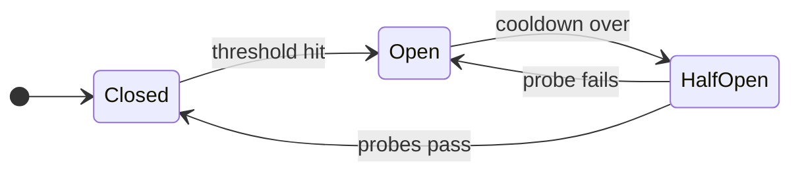
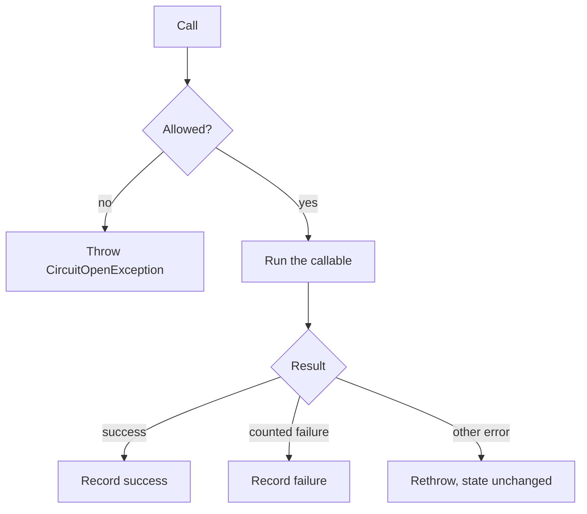

<p align="center">
  
</p>

<p align="center">
  <a href="https://packagist.org/packages/milon/fuse"></a>
  <a href="https://packagist.org/packages/milon/fuse"></a>
  <a href="https://github.com/milon/fuse/actions/workflows/tests.yml"></a>
  <a href="LICENSE"></a>
</p>

# milon/fuse

HTTP-client-agnostic **circuit breaker** for PHP 8.2+. When a dependency starts failing, Fuse stops calling it for a short time, then lets a few trial calls through to see if it has recovered.

Laravel and [Saloon](https://docs.saloon.dev/) are optional. The breaker itself only needs PHP.

Full docs: [oss.milon.im/fuse](https://oss.milon.im/fuse/)

## How a call moves through the breaker

Every call asks the breaker whether it may run. The answer depends on the circuit's state. A **counted failure** is a timeout, a connection error, or a configured HTTP status. Anything else is ignored: the original error is still thrown, but it does not move the circuit.





A call is **allowed** when the circuit is closed, or when it is half-open and a probe slot is free. The first call after the cooldown also turns an open circuit half-open. While closed, a success clears recorded failures, and a counted failure below the threshold is remembered. While half-open, the circuit closes after enough successful probes, and one counted failure re-opens it. An ignored error releases a reserved probe slot without changing the state.

While the circuit is **open**, `run()` throws `Milon\Fuse\CircuitOpenException` and does not invoke your callable. That is the point: a down dependency is not called again until the cooldown ends. The exception carries `storageKey` and `retryAfterSeconds` for logs and HTTP `Retry-After` headers.

## Terminology

| Term                  | Meaning                                                                                                                                                                                                                           |
|-----------------------|-----------------------------------------------------------------------------------------------------------------------------------------------------------------------------------------------------------------------------------|
| **Circuit**           | One protected dependency, such as a billing API. Circuits are independent.                                                                                                                                                        |
| **Closed**            | The normal state. Calls run. Counted failures are remembered until they age out of the window, or until a success clears them.                                                                                                    |
| **Open**              | The dependency is treated as down. Calls are rejected for the open duration.                                                                                                                                                      |
| **Half-open**         | The cooldown has ended. A limited number of trial calls (probes) are allowed through.                                                                                                                                             |
| **Probe**             | One trial call while half-open. `half_open_probes` is both how many probes may be in flight and how many successes are required before the circuit closes. One counted failure re-opens the circuit immediately.                  |
| **Failure threshold** | How many counted failures inside the window open the circuit.                                                                                                                                                                     |
| **Failure window**    | How far back those failures are counted. A failure older than the window no longer counts.                                                                                                                                        |
| **Open duration**     | How long an open circuit rejects calls before the next one may probe.                                                                                                                                                             |
| **Counted failure**   | A timeout, a connection error, or an HTTP status in `counted_http_statuses`. On Saloon, 502, 503, and 504 count by default. A plain `RuntimeException` counts only when its message looks like a timeout or a connection failure. |
| **Ignored error**     | Anything else, such as a validation error or a 404. It is rethrown and does not open the circuit. If it happens during a probe, the probe slot is released.                                                                       |
| **Store**             | Where the snapshot is saved. The snapshot is the state, the failure timestamps, and the probe counters.                                                                                                                           |
| **Name**              | The circuit's identity, for example `billing-sdk`. Optional `app` and `operation` split one dependency into separate circuits. The storage key looks like `fuse:punt:billing:charge`.                                             |

Pass `isFailure` or `isSuccess` to `run()` when the defaults are wrong for a call. `isFailure` receives the thrown exception and returns whether it counts. `isSuccess` receives the return value and returns whether it counts as success. A `false` result is a counted failure.

## Install

```bash
composer require milon/fuse:^1.0
```

Install Saloon only if you use the connector trait:

```bash
composer require saloonphp/saloon
```

## Callable usage

```php
use Milon\Fuse\Fuse;
use Milon\Fuse\CircuitBreakerConfig;
use Milon\Fuse\Stores\ArrayStore;

$fuse = Fuse::for(
    name: 'billing-sdk',
    store: new ArrayStore(),
    config: CircuitBreakerConfig::defaults(),
);

$result = $fuse->run(
    execute: fn () => $client->charge($payload),
);
```

`ArrayStore` in that example is for tests and single-process scripts. A production web app needs a shared store.

## Stores

### ArrayStore

`ArrayStore` keeps the snapshot in a private array on the object. Use it when every call happens in the same process: a test, a local experiment, or a CLI command that makes several requests before it exits. Calls that share that instance see the same circuit.

> **Do not use `ArrayStore` in a production web application.** PHP builds a new application for each request and discards it when the response is sent. The next request gets an empty store, so an open circuit is forgotten and traffic keeps hitting a failing dependency. Two separate `new ArrayStore()` instances do not share state either.

### Laravel cache

`LaravelCacheStore` writes the snapshot through Laravel's cache. This is the default when the service provider is registered. Every server that uses the same cache sees the same circuit on the next request.

### Database

`DatabaseStore` writes the snapshot to a `fuse_circuits` table (`key`, JSON `payload`, `expires_at`). Use it when the state should survive requests without a cache:

```bash
php artisan vendor:publish --tag=fuse-migrations
php artisan migrate
```

```dotenv
FUSE_STORE=database
```

`FUSE_DB_CONNECTION` selects a connection. Leave it empty to use the default. The migration reads `database.table` from `config/fuse.php`, so change that value before you migrate if the table name should be different.

### PSR-16

`Psr16Store` wraps any PSR-16 cache. Install `psr/simple-cache` to use it.

## Saloon

Add `HasCircuitBreaker` to a connector. Each request boots the breaker before it is sent. A counted HTTP status or a fatal transport error records a failure. An open circuit throws `CircuitOpenException` and the request is not sent.

In Laravel, the trait is enough: store and config come from `FuseManager`.

```php
use Milon\Fuse\Saloon\Traits\HasCircuitBreaker;
use Saloon\Http\Connector;

class ExampleConnector extends Connector
{
    use HasCircuitBreaker;

    public function resolveBaseUrl(): string
    {
        return 'https://api.example.com';
    }
}
```

Without Laravel, override `resolveCircuitBreakerStore()` (and optionally name or config). The default circuit name strips a trailing `Connector` and kebab-cases the rest (`BillingConnector` → `billing`).

Implement `Milon\Fuse\Saloon\Contracts\HasCircuitBreakerOperation` on a request to give that operation its own circuit. `resolveCircuitBreakerOperation()` becomes the `operation` segment of the storage key.

## Laravel

The service provider is discovered automatically. It reads `config/fuse.php` and shares circuit state through the cache.

```bash
php artisan vendor:publish --tag=fuse-config
```

```php
use Milon\Fuse\Laravel\Facades\Fuse;

$result = Fuse::for('billing-sdk')->run(
    execute: fn () => $client->charge($payload),
);

// or: fuse('billing-sdk')->run(...)
```

Set `FUSE_STORE=database` to use the database store after the migration has run. Set `cache_store` to pin a cache driver when the store is `cache`. A `breakers` entry overrides the defaults for one circuit name:

```php
'breakers' => [
    'billing-sdk' => [
        'failure_threshold' => 3,
        'open_seconds' => 15,
    ],
],
```

`Fuse::for('billing-sdk')` and `Fuse::configFor('billing-sdk')` pick up that override.

Listen for `Milon\Fuse\Events\CircuitOpened` (and `CircuitClosed` / `CircuitHalfOpened`) when a circuit changes state.

```bash
php artisan fuse:status billing
php artisan fuse:reset billing --force
```

A Saloon connector that uses `HasCircuitBreaker` picks up the same store and named config automatically. The derived name (`BillingConnector` → `billing`) is what `breakers.billing` matches.

If package discovery is disabled, register `Milon\Fuse\Laravel\FuseServiceProvider` yourself.

## Defaults

The default configuration is lenient: a brief blip does not open the circuit, and a single server error does not count unless you opt in.

| Setting                 | Default       | What it does                                                              |
|-------------------------|---------------|---------------------------------------------------------------------------|
| Failure threshold       | 8             | Counted failures inside the window that open the circuit                  |
| Failure window          | 60s           | How long a failure stays in that count                                    |
| Open duration           | 30s           | How long calls are rejected after opening                                 |
| Half-open probes        | 2             | Trial calls allowed in flight, and successes required to close            |
| Counted HTTP statuses   | 502, 503, 504 | Saloon responses that count as failures                                   |
| Count timeouts          | true          | Exceptions whose class or message looks like a timeout                    |
| Count connection errors | true          | Exceptions that look like a refused connection, DNS failure, or TLS error |
| Count HTTP 500          | false         | When true, a 500 is added to the counted statuses                         |
| Key prefix              | `fuse`        | First segment of every storage key                                        |

## Development

```bash
composer install
composer test
```

## License

MIT
