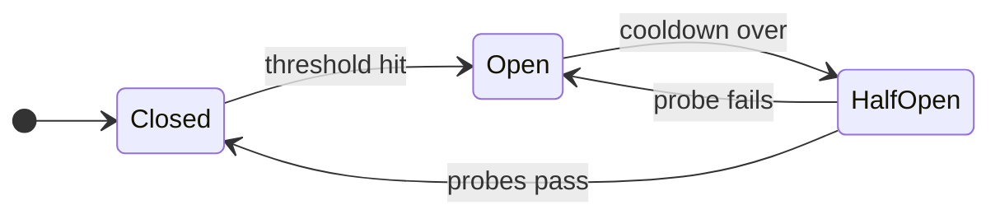
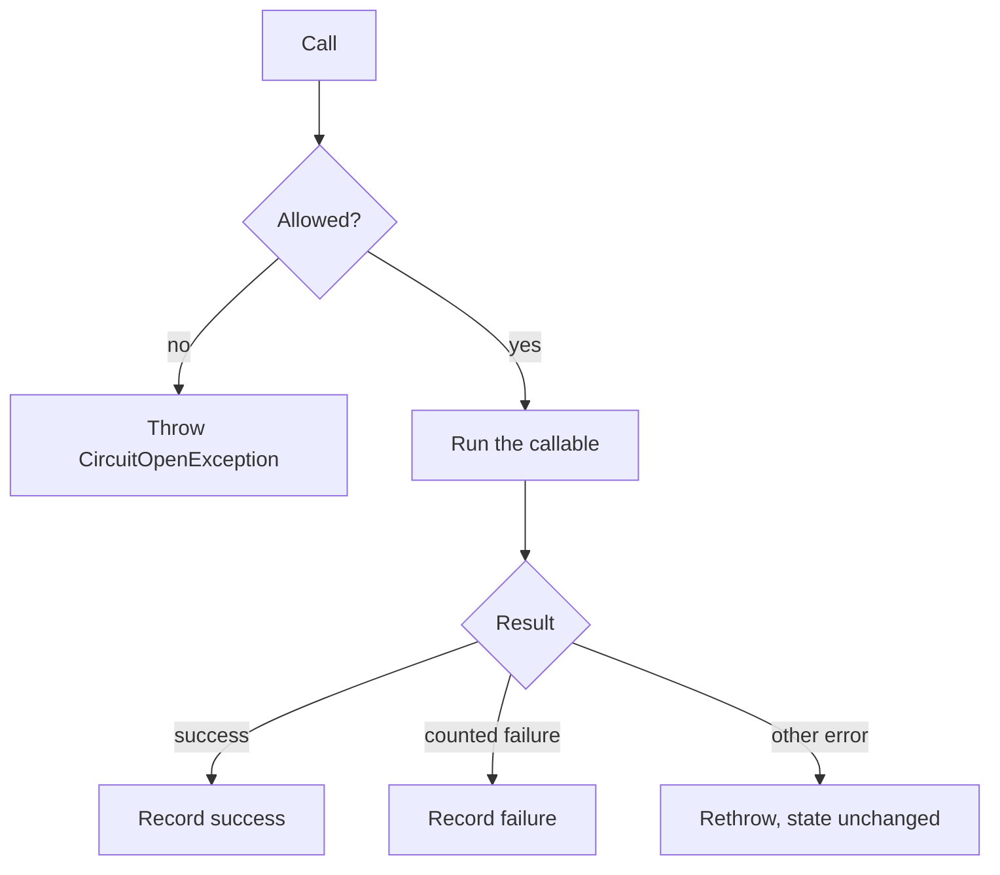

# How it works

A circuit is one protected dependency, such as a billing API. Fuse stores a small snapshot for that circuit: the state, the recent failure timestamps, and the half-open probe counters. Every call reads that snapshot, decides whether to run, then writes the snapshot back.

A call is **allowed** when the circuit is closed, or when it is half-open and a probe slot is free. The first call after the cooldown also turns an open circuit half-open. While closed, a success clears recorded failures, and a counted failure below the threshold is remembered. While half-open, the circuit closes after enough successful probes, and one counted failure re-opens it. An ignored error releases a reserved probe slot without changing the state.

While the circuit is **open**, `run()` throws `Milon\Fuse\CircuitOpenException` and does not invoke your callable. The exception includes `storageKey` and `retryAfterSeconds` so callers can log or set a `Retry-After` header.

## Terminology

| Term | Meaning |
| --- | --- |
| **Circuit** | One protected dependency. Circuits do not share failure counts. |
| **Closed** | Calls run. Counted failures are remembered until they age out of the window, or until a success clears them. |
| **Open** | The dependency is treated as down. Calls are rejected for the open duration. |
| **Half-open** | The cooldown has ended. A limited number of trial calls are allowed through. |
| **Probe** | One trial call while half-open. `half_open_probes` is both how many probes may be in flight and how many successes are required before the circuit closes. |
| **Failure threshold** | How many counted failures inside the window open the circuit. |
| **Failure window** | How far back those failures are counted. Older timestamps drop out of the count. |
| **Open duration** | How long an open circuit rejects calls before the next call may probe. |
| **Counted failure** | A timeout, a connection error, or an HTTP status you listed. See [Failures](05-failures.html). |
| **Ignored error** | Anything else. It is rethrown. It does not open the circuit. |
| **Store** | Where the snapshot is saved between calls. See [Stores](06-stores.html). |
| **Name** | The circuit identity, for example `billing-sdk`. |
| **Operation** | Optional extra segment, so `charge` and `refund` can trip separately. |
| **App** | Optional segment when several applications share one store. |

The storage key joins those pieces with colons. Empty pieces are left out.

| name | app | operation | key |
| --- | --- | --- | --- |
| `billing-sdk` | | | `fuse:billing-sdk` |
| `billing` | `punt` | `charge` | `fuse:punt:billing:charge` |

The prefix defaults to `fuse`. Change it with `key_prefix` / `FUSE_KEY_PREFIX`.

## What is stored

Each snapshot holds:

| Field | Role |
| --- | --- |
| `state` | `closed`, `open`, or `half_open` |
| `opened_at` | Unix time when the circuit last opened. Null while closed. |
| `failures` | Unix timestamps of counted failures still inside the window. |
| `half_open_successes` | Successful probes so far. |
| `half_open_inflight` | Probes that have started and not finished. |

The store keeps that snapshot until it expires. Fuse writes it with a TTL of twice the longer of the failure window and the open duration, so an idle circuit disappears on its own.

## A short timeline

Defaults: threshold 8, window 60 seconds, open for 30 seconds, 2 probes.

1. Seven counted failures in a minute leave the circuit **closed**. The eighth opens it.
2. For the next 30 seconds every call throws `CircuitOpenException`. Your callable does not run.
3. The next call after 30 seconds moves the circuit to **half-open** and runs as a probe.
4. A second probe may run at the same time, because two slots are allowed.
5. Two successes close the circuit and clear the failure list.
6. One counted failure during a probe opens the circuit again and the 30 second cooldown starts over.

A success while the circuit is still closed also clears the failure list. One good call after a few blips does not leave those blips sitting in the window.
